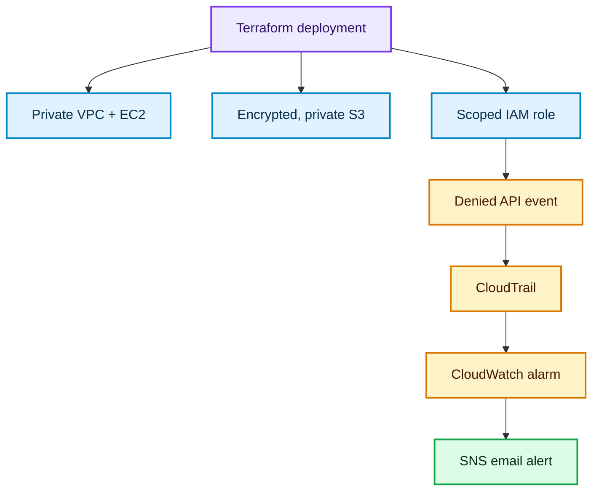

# Cloud Infrastructure & Security Monitoring

I built an AWS lab to test whether a denied API action would be recorded, detected and reported by email. It combined private infrastructure, scoped access, logging, automated checks and a controlled alert test. The lab ran in `eu-west-2` on 29 September 2026 and was destroyed after validation.

## Architecture

Terraform defined the infrastructure and alert path. A Python script ran seven read-only checks against the deployed configuration.

## Security design

| Control | Design choice |
| --- | --- |
| Network | The EC2 instance ran in a private subnet with no public IPv4 address. Its security group had no inbound or outbound rules. |
| Storage | The data bucket blocked public access and had default encryption and versioning enabled. |
| Access | A reader role could list the lab bucket and read its objects, without broad S3 or EC2 permissions. |
| Monitoring | CloudTrail sent management events to CloudWatch Logs. A metric filter and alarm watched for denied API activity and notified an SNS email subscription. |

## My approach

I wanted to show that a security control could be tested end to end: a restricted identity makes an API request, AWS records the denial, and an alert reaches a person. I kept the EC2 instance private, limited the S3 reader role to one bucket, and used a dry-run request so the test could not delete the VPC.

The first validation run exposed a credential-provider dependency issue. After resolving it, all seven checks passed. This was a useful reminder to test the validation tooling as carefully as the infrastructure.

## What I verified

| Area | Observed result |
| --- | --- |
| Deployment | Terraform created 25 resources, including a private EC2 instance. |
| Security settings | S3 public access was blocked, default encryption and versioning were enabled, and the instance security group had no inbound or outbound rules. |
| Automated checks | All 7 Python checks passed. |
| Detection | A restricted role's denied dry-run `DeleteVpc` request appeared in CloudTrail. No VPC was deleted. |
| Alert | CloudWatch entered ALARM about four minutes after the recorded denial, and SNS delivered an [email notification](alert-email.png). This timing is from one run, not a delivery guarantee. |
| Cleanup | Terraform reported 25 resources destroyed. |

The email screenshot has account information covered.

This was a disposable test environment. The Python checks run on demand; they are not a continuous compliance service.

**Next iteration:** run the checks on a schedule and measure alert delivery across several tests, rather than relying on a single observed run.
